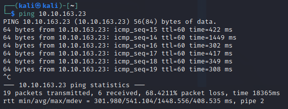
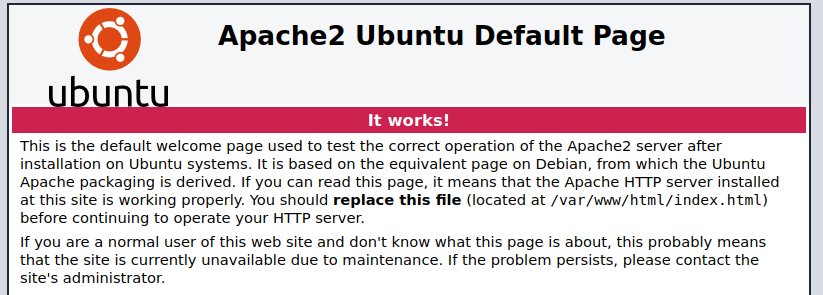
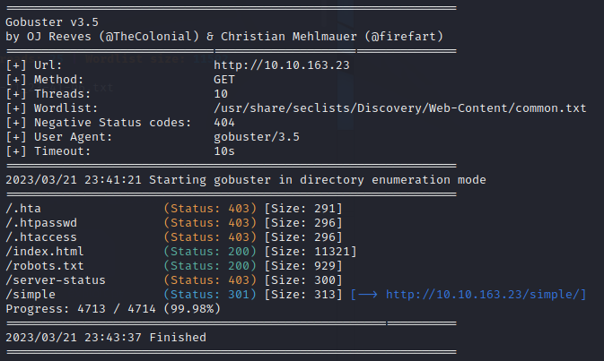
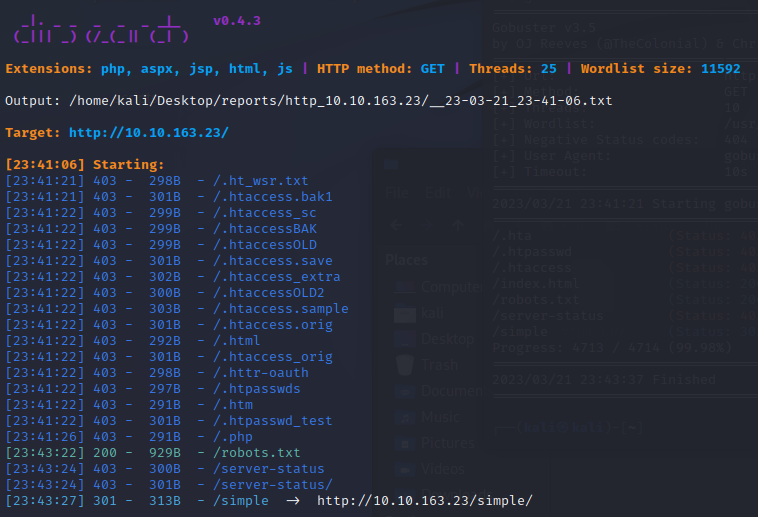
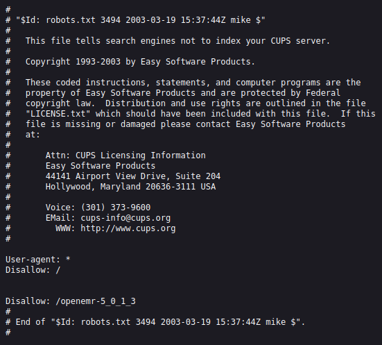

# Simple CTF

首先拿到機器 IP `10.10.163.23`，測試機器是否已上線

`ping 10.10.163.23`



接著使用 nmap 掃描，查看有哪些服務，這邊我嘗試同時用 `sT` 和 `sV` 來掃，因為 `sT` 速度較快而 `sV` 具有較多資訊，算是一種省時間的策略

`nmap -v -sT --min-rate 4000 10.10.163.23`


`nmap -v -sV -p- --min-rate 5000 10.10.163.23`


可以看到，掃出了 21 (`ftp`), 80 (`http`) 以及一個不確定是否為雜訊的 2222 (`EtherNetIP-1`) port

所以已知有網頁服務，嘗試用瀏覽器打開，會發現開起來是一個 `Apache` 的歡迎頁面



同時，我們也可以用 gobuster 掃掃看有沒有奇怪的路徑，這邊和前一題一樣同時也用 dirsearch 掃以免有漏網之魚

`gobuster dir -u 10.10.163.23 -w /usr/share/seclists/Discovery/Web-Content/common.txt`



`python ./dirsearch/dirsearch.py --url http://10.10.163.23/`



找到了以下路徑:

```
index.html
robots.txt
/simple/
```

`index.html` 就是前面的畫面，而先找到的 `robots.txt` 如下:



可以看到有一個 `openemr_5_0_1_3` 的路徑，但是嘗試察看發現是 `404 Not Found`，另外也可以從錯誤訊息注意到 `Apache` 版本為 `2.4.18`


因此我們接下來關注另一個 `/simple/` 路徑，發現似乎是一個叫做 `CMS made simple` 的東西做的


而拉到下面註腳部分可以看到他的版本為 `2.2.8`


而搜尋一下 exploit 或是 cve 之類的網站 (或也可以用 `searchsploit` 來找)，可以發現這個版本有 `CVE-2019-9053` 的漏洞

根據 cve 資料，這個漏洞可以透過 `m1_idlist` 參數做 time-based 的 SQLi，而我也嘗試用 sqlmap 來找，但一直試不成功，所以這邊偷偷看一下[別人的 writeup](https://n0w4n.nl/easyctf/)，發現這個人是直接拿 exploitdb 的腳本來 exploit

此外在閱讀 writeup 時也注意到前面掃出來的 port 2222 其實是 SSH ! 推測應該是因為 writeup 中有使用 `sC` 搭配 `sV` 參數的關係

而我也嘗試拿 exploitdb 的腳本來跑，但是因為 python 版本的一些原因沒辦法用，所以上網搜尋一下，發現了[這個](https://github.com/e-renna/CVE-2019-9053/blob/master/exploit.py)別人改成 python3 的版本

總之下載下來後，搭配 `rockyou.txt` 進行密碼爆破，但是發現可能是字典檔中有一些非 ascii 字元導致出現錯誤

`python exploit.py -u http://10.10.163.23/simple --crack -w ~/Desktop/temp/rockyou.txt`


因此我也嘗試使用其他的字典檔，但是一直破解不出，而後又看了一下 writeup 改用了 `seclist` 中的 `best110.txt` 字典檔，而雖然改用了之後仍然破解的不太穩定，推測可能因為是 time-based SQLi 的關係，但總之最後還是成功破解出密碼為 `secret`

`python exploit.py -u http://10.10.163.23/simple --crack -w /usr/share/seclists/Passwords/Common-Credentials/best110.txt`


有了帳號密碼，可以嘗試登入前面發現的 SSH，發現能成功登入

`ssh mitch@10.10.163.23 -p 2222`


確認一下目前身分及群組


直接在當前目錄下發現了 `user.txt`


```
G00d j0b, keep up!
```

接著需要想辦法提權，首先使用 `sudo -l` 查看我們是否有可以用的 `sudo`，發現我們可以使用 `/usr/bin/vim`


首先輸入 `sudo /usr/bin/vim`，使用 root 身分使用 vim

接著輸入 `:!/bin/sh`，生成一個 shell 以方便我們操作

確認我們身分，發現確實成為 root


在 `/root` 下找到 `root.txt`


```
W3ll d0n3. You made it!
```

至此，我們已取得完整機器權限